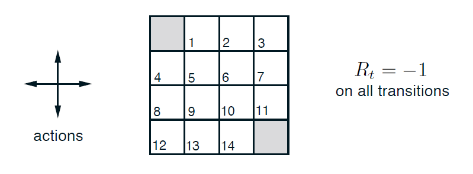
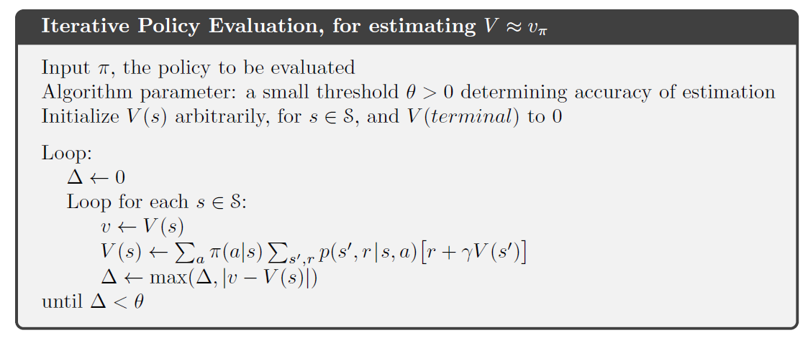
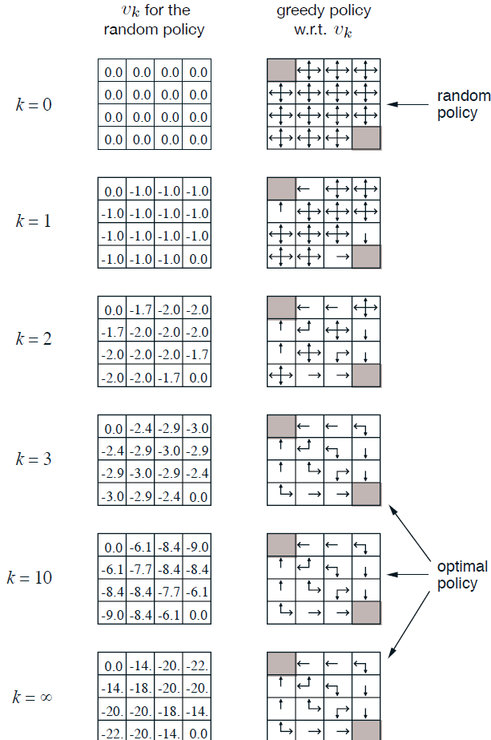
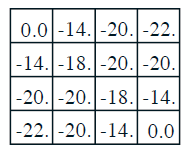

# Gridworld Environment: Iterative Policy Evaluation with an Equiprobable Random Policy
This project addresses the classic Gridworld problem using an equiprobable random policy and iterative policy evaluation. Both state-value and action-value functions are computed, and the effects of updating environment dynamics—including adding a new state are examined.

## Overview
This project considers a deterministic 4x4 gridworld with states numbered from 0 to 15, where states 0 and 15 are terminal. In this environment, every step incurs a constant reward of –1. The goal is to compute the state-value function V𝜋(𝑠) under an equiprobable random policy (each action is chosen with a probability of 0.25) using iterative policy evaluation. Additionally, the project calculates specific action-value functions and examines the impact of modifying environment dynamics by introducing a new state and updating transition rules.

## Features
Deterministic Gridworld: States numbered 0–15 with terminal states 0 and 15. Equiprobable Random Policy: Each action ("up", "down", "left", "right") is chosen with equal probability (0.25). Iterative Policy Evaluation: The state-value function is updated iteratively using the Bellman equation until convergence. Action-Value Functions: Computation of action-value functions for specific state-action pairs (e.g., 𝑞𝜋(11,’down’) and 𝑞𝜋(7,’down’)) Dynamic Environment Updates: Investigation of the impact when a new state is added (state 15) and transition rules are updated. Visualization: State-value functions are visualized using heatmaps via Matplotlib and Seaborn.

## Requirements
- Python 3.x
- NumPy
- Matplotlib
- Seaborn

## Code Structure and Explanation
Gridworld Environment
States and Actions: The grid is defined as a 4x4 environment with states numbered 0–15. The possible actions are "up", "down", "left", and "right". Transition Function (f(s, a)): This function computes the next state given the current state s and action 𝑎 . If an action would move the agent off the grid, the agent remains in the same state. Reward Function: Every transition yields a constant reward of –1.

## Iterative Policy Evaluation
Function: value_iteration_random_policy
The function updates the value of each non-terminal state by averaging the expected returns from all actions, while keeping terminal state values fixed at 0. The process iterates until the maximum change (delta) is below a specified threshold (θ).When logging is enabled, a heatmap of the value function is shown at each iteration.

## Action-Value Function Computation
Functions: q_pi and compute_q 

These functions compute the action-value function q_pi(𝑠,𝑎) for given state-action pairs using the immediate reward and the value of the next state. For instance, the calculations yield: 𝑞𝜋(11,’down’)=−1, 𝑞𝜋(7,’down’)=−15

## Dynamic Updates and New State
New State Addition: An extra state (state 15) is introduced in addition to the 4x4 grid.

Updated Dynamics:
- *Exercise 4.2*: Specific actions from state 15 lead deterministically to states 12, 13, 14, or remain in state 15. Moreover, the transition for state 13 is updated so that the "down" action leads to the new state.
- *Exercise 4.3*: Reformulations of the state-value function as action-value functions are provided with derivations that relate both functions.
- *Evaluation Outcome*: In both scenarios, the iterative policy evaluation converges (approximately after 300 iterations) with 𝑣𝜋(15)≈−20.

## Experimental Results
Convergence: The state-value function converges after roughly 300 iterations.
Terminal States: Terminal states (0 and 15) maintain a value of 0.
Action-Value Functions: For example, the computed values are: 𝑞(11,’down’) = −1 𝑞 (7,’down’)=−15
Dynamic Updates: The addition of the new state and the modified transition dynamics were successfully integrated, with the updated evaluation still converging to a similar value (𝑣𝜋(15)≈−20).

## References
- Sutton, R. S. & Barto, A. G., Reinforcement Learning: An Introduction, 2nd ed., MIT Press, 2018.
- Puterman, M. L., Markov Decision Processes: Discrete Stochastic Dynamic Programming, Wiley, 1994.
